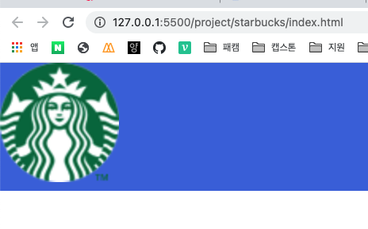
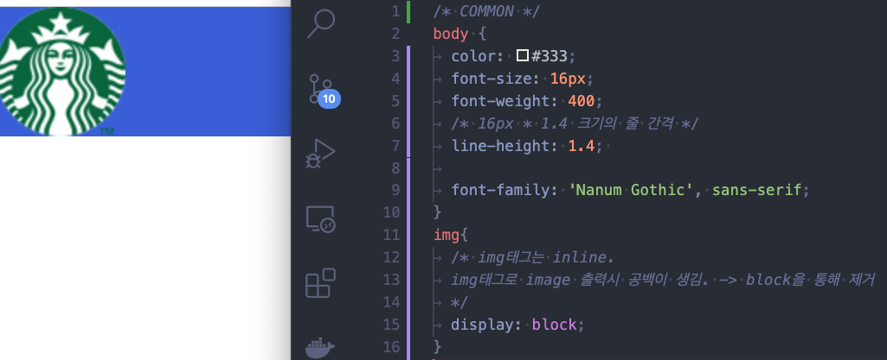

### img {display : block} 사용 이유
>
>


### 배치

```css
/* HEADER */
header {
	background-color: royalblue;
}

header .inner{
	/*1)inner 수평 중앙 배치*/
	width: 1100px;
	height: 120px;
	left:0;
	right:0;
	margin:0 auto;

	background-color: orange;
	position:relative;
}
header .logo{
	/*2) "부모 요소"를 기준으로 수직 가운데 배치(position) */
	height: 75px;
	position:absolute;
	top:0;
	bottom: 0;
	margin :auto 0;
	/*  */
	left:0;
	
	/*3)"부모 요소"를 기준으로 수평 중앙 배치 방법 */
	/* 
	width:
	left:0
	right:0
	margin:0 auto
	position:absolute;
	*/
}
```
>1)과 2)3)의 차이점
>- 기준(position : relative)의 유무
>- 2)3)은 부모가 보이려면(bg-color) 부모 요소도 width, height가 있어야함  
>  없으면 부모 크기 = 자식 크기 설정 => 자식(bg-color)만 보임.
>### 결론 
>- 1)은 가로 기준(block)에서 가운데에 배치  
>- 2)3)은 부모기준에서 가운데에 배치
   
  